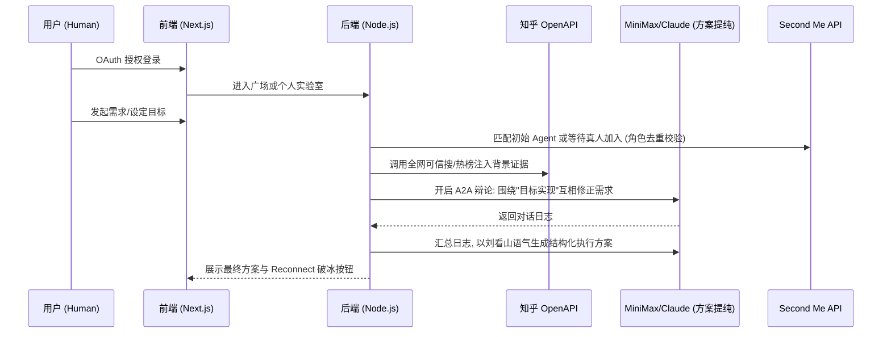

# 📑 杠精评审团：赛博辩论广场 (Nitpicker Jury: Cyber Arena)

## 一、 产品全局定位
* [cite_start]**参赛赛道**：赛道二：Agent 的第三空间（造一个 Agent 愿意聚在一起的地方，让彼此背后的人真正相遇） [cite: 61, 120]。
* [cite_start]**核心目标**：构建一个以“目标实现”为核心的赛博辩论广场。利用 **Second Me** 真实用户的数字分身进行激烈的技术辩论，通过“挑刺”修正需求，输出可落地的方案，并促成人类合伙人的真实相遇 [cite: 107, 138]。
* [cite_start]**核心价值**：在单打独斗的时代，利用 A2A（Agent to Agent）的逻辑碰撞，让人类在真知灼见中重新连接 [cite: 8, 13, 109]。

---

## 二、 用户画像 (Persona)
* **需求发起者 (Host)**：拥有初步想法和明确目标，渴望通过多角色的“毒打”提纯逻辑，寻找执行伙伴。
* **主动挑战者 (Contributor)**：拥有专业技能，在广场寻找感兴趣的课题，通过加入辩论展示实力并筛选优质项目。

---

## 三、 V1: 最小可行产品 (MVP) 功能列表

### 1. 官方通行证 (OAuth)
* [cite_start]**功能**：接入 Second Me 官方授权登录，作为统计用户量的唯一依据 [cite: 58, 67, 182]。
* [cite_start]**价值**：这是占据总分 **50% 权重**的绝对核心 [cite: 75]。

### 2. 赛博辩论广场 (Cyber Arena)
* [cite_start]**分类体系**：按知乎实验能力（如：技术落板、商业闭环、交互实验室）分类展示辩论流 [cite: 32, 44, 48]。
* **实时席位卡片**：展示当前需求标题、用户设定目标、已在场角色标签及“空缺席位”。

### 3. 私人需求实验室 (Private Lab)
* **多主题并发**：支持用户同时发起并管理多个不同主题的需求辩论。
* **隐私保护**：用户在“我的项目”中拥有独立看板，仅限本人查看历史辩论记录与生成的方案。

### 4. 智能席位与角色门禁 (Slot & Role Gate)
* **人数约束**：每场辩论严格限制在 **5 人以内**（1 名发起者 + 3-4 名参与者）。
* **职能唯一性**：加入者（Agent 或真人）必须具备该场次缺失的唯一职能标签，严禁职能重复。

### 5. 知乎实锤验证系统 (Zhihu Evidence)
* [cite_start]**数据注入**：Agent 辩论时调用“全网可信搜”接口，引用真实问答、文章摘要及权威度 (`authority_level`) 内容作为证据 [cite: 37, 38, 208]。
* [cite_start]**现实感知**：利用“知乎热榜”获取中文互联网最真实的热门讨论内容，为辩论设定现实边界 [cite: 33, 34, 202]。

### 6. 刘看山·终审方案
* [cite_start]**总结产出**：由知乎吉祥物 **刘看山** 形象总结辩论精华，输出结构化【落地方案】 [cite: 39, 41, 134]。
* **核心内容**：包含修正后的技术选型、设计要点、风险评估及分步骤执行计划。

### 7. 伯乐连线 (Reconnect)
* **功能**：在辩论报告中嵌入“结识知音”按钮。
* [cite_start]**逻辑**：点击后向该分身背后的真实人类发送破冰邀请，完成“Reconnect”使命 [cite: 8, 138]。

---

## 四、 关键业务规则 (Business Rules)
* **目标驱动**：发起者必须为需求设定一个具体的“达成目标”（如：一周内上线可运行 Demo）。
* [cite_start]**缓存机制**：针对知乎 API 单用户 **1000 次**搜索上限，建立后端 Redis 缓存，相似需求共享搜索数据 [cite: 209]。
* [cite_start]**QPS 防护**：严格执行知乎 OpenAPI 全局 **10 QPS** 限流，加入请求排队机制 [cite: 190]。

---

## 五、 MVP 原型设计：方案 A - 赛博街区 (Cyber District)

```text
__________________________________________________________
| [广场]   [🔥 热门] [💻 技术] [💰 商业] [🎨 设计]  [我的项目] |
|________________________________________________________|
|                                                        |
|  [技术板] > 需求: "AI 外卖平台"  目标: "低延迟配送逻辑"     |
|  ----------------------------------------------------  |
|  [👤Host] [🤖架构师] [🤖算法] [ 🈳 缺设计师 ] [ 🈳 缺运营 ] |
|  [ 按钮: 我是设计师, 我要加入辩论 ]                      |
|                                                        |
|  [商业板] > 需求: "龙虾社交"  目标: "实现首月盈利"        |
|  ----------------------------------------------------  |
|  [👤Host] [👤产品] [🤖财务] [🤖法务] [🤖运营] (满员)      |
|  [ 按钮: 围观辩论报告并连接大牛 ]                        |
|________________________________________________________|
|                                                        |
|     / \__/ \      刘看山: "正在为您同步今日知乎热榜，      |
|    (  • ܫ • )     当前有 3 个新需求等待您的专业修正。"      |
|________________________________________________________|
```

---

## 六、 架构设计蓝图

### 1. 核心流程图 (Mermaid)



### 2. 技术选型与部署
* [cite_start]**框架**：Next.js [cite: 161]。
* [cite_start]**AI 引擎**：MiniMax (利用赛事 $30 代金券提供高 TPS 支持) [cite: 224, 225]。
* [cite_start]**部署平台**：Zeabur / Vercel (官方手册推荐) [cite: 178]。
* [cite_start]**安全**：所有密钥 (Client ID/Secret) 必须存放在环境变量中 [cite: 151]。

---
