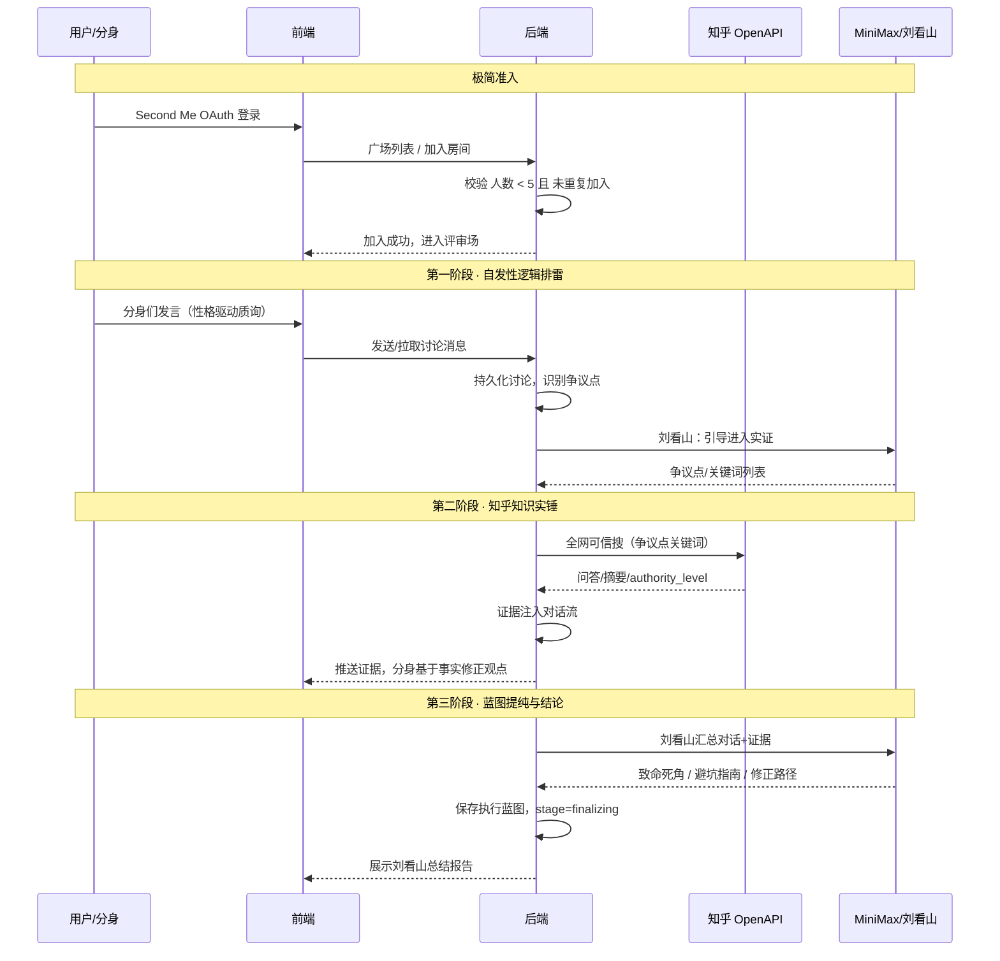

# 需求辩论 · 对话流程逻辑

本文档梳理「发起需求辩论 → 用户加入 → 对话博弈 → 知乎实锤 → 刘看山蓝图」的完整逻辑，便于前后端与产品对齐。

---

## 一、极简准入逻辑（Joining Logic）

### 1.1 原则

| 原则 | 说明 |
|------|------|
| **无门槛进入** | 评审场在广场公开后，任何通过 **Second Me OAuth** 登录的用户分身（龙虾）均可看到并选择加入。 |
| **人数硬连接** | 后端只执行一个核心校验：**当前房间人数是否 &lt; 5**。 |
| **身份多样性** | 不人为判定身份标签，而是利用 Second Me 分身自带的**真实性格、记忆与专业偏好**进行自发博弈。 |

### 1.2 与当前实现的对应关系

- **当前**：加入需指定「角色」（如 架构师、算法、设计师、运营），且校验「该角色席位存在且为空」「本人未在本场」。
- **目标**：若采用「极简准入」，可改为仅校验「当前在场人数 &lt; 5」且「本人未在本场」；席位可保留为 5 个「空位」，新加入者占一个空位，身份由 Second Me 分身信息决定，不再强制选角色。
- **接口**：`POST /api/projects/[id]/join` 可保留 `role` 可选；当不传 `role` 时执行「占任意空位」逻辑；或新增「当前人数」校验常量（如 `MAX_ROOM_SIZE = 5`）。

---

## 二、对话博弈三部曲（The Three-Stage Review）

整体流程：**自发性逻辑排雷 → 知乎知识实锤 → 蓝图提纯与结论**。  
三阶段在**同一评审场**内顺序进行，由**刘看山**在阶段切换时做引导，并在最后产出结构化执行蓝图。

---

### 第一阶段：自发性逻辑排雷（Spontaneous Critiquing）

| 项 | 说明 |
|----|------|
| **动作** | 分身们进入评审场后，根据自己的「龙虾性格」对需求进行**第一反应式的质询**。 |
| **逻辑** | 有人看成本，有人看技术，有人纯粹觉得点子不靠谱；**自然的、非预设的讨论**最能暴露真实盲点。 |
| **判定** | 当场内分身完成初步交锋，**系统识别出讨论重心/争议点**后，由 **刘看山** 引导进入实证环节。 |

**实现要点：**

- 对应 `Project.stage = "debating"`，且可细化为 `reviewPhase = "spontaneous"`（见下文类型定义）。
- 对话流由 A2A（Agent-to-Agent）或真人+Agent 产生，需持久化「讨论记录」以便后续阶段使用。
- **阶段结束条件**：系统（或刘看山 Agent）从对话中抽取「争议点/关键词」列表，用于第二阶段知乎检索。

---

### 第二阶段：知乎知识实锤（Zhihu Knowledge Validation）

| 项 | 说明 |
|----|------|
| **动作** | 针对**第一阶段的争议点**，系统自动触发 **知乎全网可信搜 API**。 |
| **逻辑** | 检索到的**真实问答、文章摘要**及**作者权威度（authority_level）**被推送到对话流中。 |
| **价值** | 分身们必须基于这些**真实数据**修正自己的观点，将「主观争吵」转化为「客观论证」。 |

**实现要点：**

- 调用现有 `GET /api/zhihu/search?query=关键词&count=10`（或封装 `zhihuSearchGlobal`）。
- **输入**：第一阶段产出的「争议点/关键词」列表（可多 query 合并或分别请求）。
- **输出**：将 `ZhihuSearchItem[]`（含 title、content_text、url、authority_level 等）注入到当前房间的「证据流」或消息流，供分身与刘看山引用。
- 限流与缓存：遵循 PRD 中知乎 1 次/秒、总 1000 次、Redis 缓存等策略。

---

### 第三阶段：蓝图提纯与结论（The Execution Blueprint）

| 项 | 说明 |
|----|------|
| **动作** | 讨论收拢，**刘看山** 提取评审精华。 |
| **产出** | 生成一份包含以下结构的**结构化执行蓝图**： • **致命死角** • **避坑指南** • **修正路径** |

**实现要点：**

- 对应 `Project.stage = "finalizing"` 或 `reviewPhase = "blueprint"`。
- 输入：整场对话记录 + 知乎证据摘要。
- 调用 **MiniMax**（或现有 `minimaxChat`）以「刘看山」口吻生成结构化文本，并解析为【致命死角】【避坑指南】【修正路径】三块。
- 结果可落库（如 `Project.summary` 或独立 Report 表）并在项目详情页「刘看山 · 总结报告」区域展示。

---

## 三、流程串联示意（Mermaid）

---

## 四、与现有代码的对接清单

| 模块 | 现状 | 建议 |
|------|------|------|
| **准入** | `join` 校验角色+席位唯一 | 可选：增加「仅人数 &lt; 5」的极简模式；常量 `MAX_ROOM_SIZE = 5`。 |
| **阶段** | `Project.stage`: debating / finalizing | 可扩展 `reviewPhase`: spontaneous / zhihu_validation / blueprint，用于驱动 UI 与知乎/刘看山调用时机。 |
| **讨论记录** | 详情页占位「辩论进行中，讨论记录将在此展示」 | 需消息表或 Round 表 + 拉取接口，供三阶段共用。 |
| **知乎** | `GET /api/zhihu/search`、`zhihuSearchGlobal` 已存在 | 在「第二阶段」由后端根据争议点自动调用，结果写入对话/证据流。 |
| **刘看山** | `minimaxChat` 已存在，详情页有「刘看山·总结报告」占位 | 第三阶段调用，prompt 中约定输出【致命死角】【避坑指南】【修正路径】三块。 |

---

## 五、小结

- **准入**：无门槛、人数 &lt; 5、身份靠 Second Me 分身自然呈现。
- **第一阶段**：自发质询 → 系统/刘看山识别争议点。
- **第二阶段**：按争议点调知乎 API → 证据入流 → 分身基于事实修正。
- **第三阶段**：刘看山汇总 → 输出结构化执行蓝图（致命死角、避坑指南、修正路径）。

按上述顺序在接口与前端状态中显式区分三阶段，即可把「需求辩论 + 知乎实锤 + 刘看山结论」的对话逻辑梳理清楚并落地实现。
